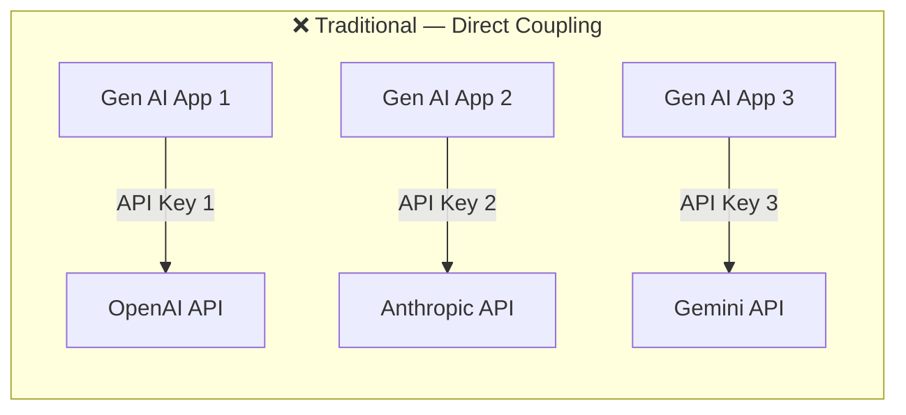
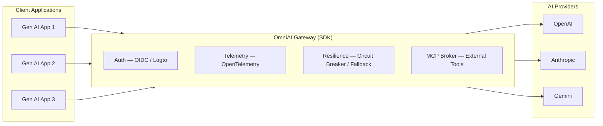
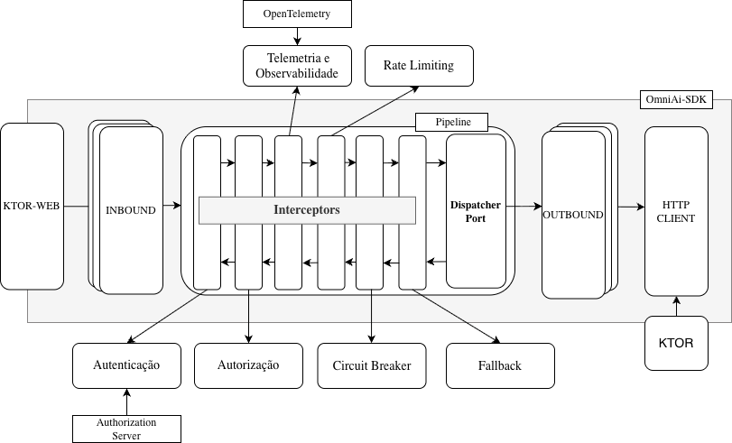
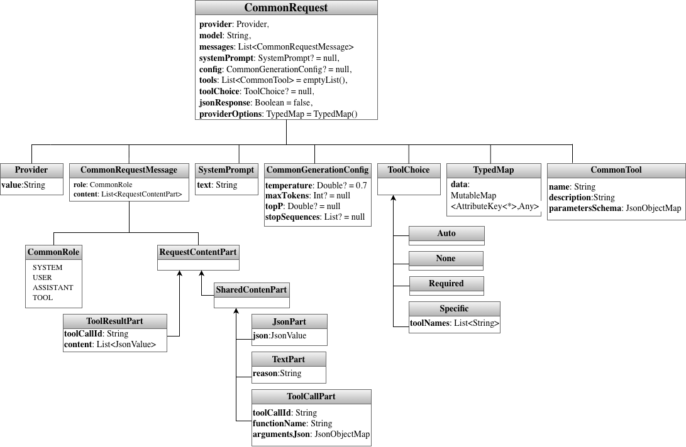
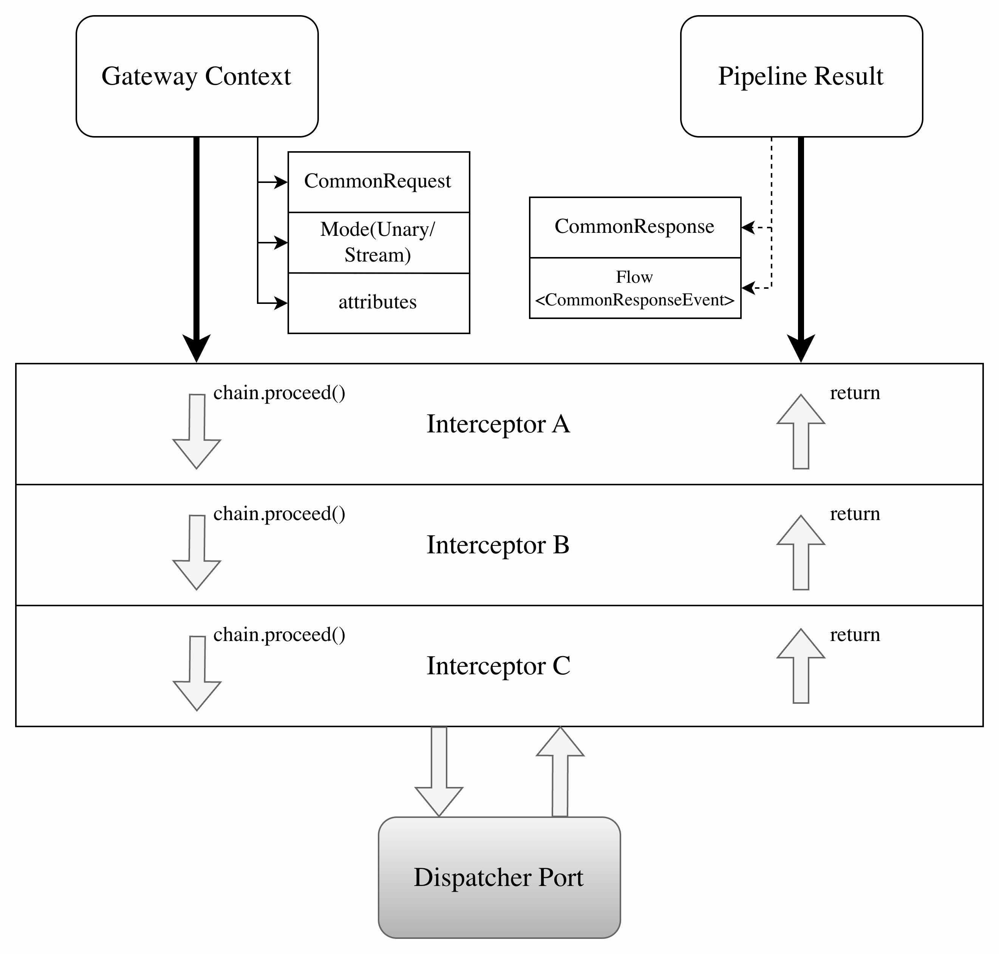
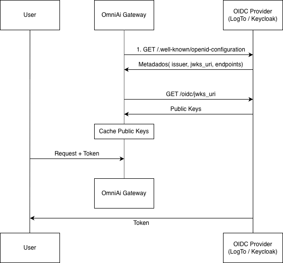
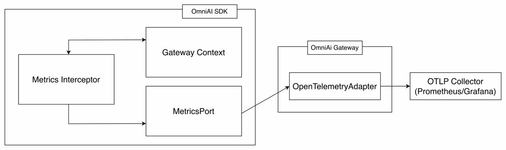
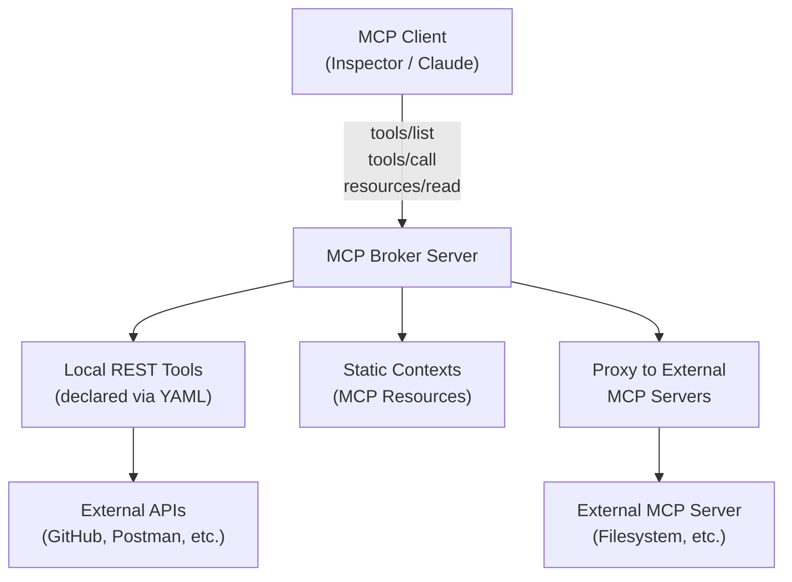

# OmniAI Gateway & OmniAI SDK

> **Final Year Project — Bachelor's Degree in Computer Science and Engineering (LEIC)**  
> **Instituto Superior de Engenharia de Lisboa (ISEL)**  
> **Authors:** Guilherme Coutinho (No. 50467) & André Nunes (No. 51766)  
> **Supervisor:** Prof. Pedro Félix

[-7F52FF?logo=kotlin&logoColor=white)](https://kotlinlang.org/docs/multiplatform.html)
[](https://ktor.io/)
[-blue)](https://modelcontextprotocol.io/)
[](https://opentelemetry.io/)
[-5D34F2)](https://logto.io/)
[-red?logo=adobeacrobatreader&logoColor=white)](docs/OmniAI_Gateway_Relatorio_Final.pdf)

---

## Project Report

The full project report, written in LaTeX, is available directly in the repository:

- 📥 **[Download Final Report (PDF)](docs/OmniAI_Gateway_Relatorio_Final.pdf)**

---

## Table of Contents

1. [Overview & Motivation](#overview--motivation)
2. [Proposed Solution](#proposed-solution)
3. [System Architecture (Ports & Adapters)](#system-architecture-ports--adapters)
4. [Common Domain & Normalisation](#common-domain--normalisation)
5. [Interceptor Pipeline](#interceptor-pipeline)
   - [Authentication (OIDC / OAuth2 Resource Server)](#1-authentication-authenticationinterceptor)
   - [Authorisation (PEP / PDP)](#2-authorisation-policyenforcerinterceptor)
   - [Observability & Telemetry (OpenTelemetry)](#3-observability--telemetry-metricsinterceptor--tracinginterceptor)
   - [Rate Limiting (Token Bucket)](#4-rate-limiting-ratelimitinterceptor)
   - [Circuit Breaker](#5-circuit-breaker-circuitbreakerinterceptor)
   - [Intelligent Fallback](#6-intelligent-fallback-fallbackinterceptor)
   - [Structured Logging](#7-structured-logging-requestlogginginterceptor)
6. [MCP Broker & External Tools](#mcp-broker--external-tools)
7. [Cross-Platform Distribution (KMP)](#cross-platform-distribution-kmp)
8. [Repository Structure](#repository-structure)
9. [HTTP Endpoints (PoC)](#http-endpoints-poc)
10. [Setup & Running](#setup--running)
11. [Validation Scenarios & PoCs](#validation-scenarios--pocs)
    - [1. REST Client Tests](#1-rest-client-tests-gateway-requestshttp)
    - [2. Claude Code Integration](#2-claude-code-integration-run_claudepy)
    - [3. Official Anthropic Node.js SDK Test](#3-official-anthropic-nodejs-sdk-test)
    - [4. Grafana Monitoring Dashboards](#4-grafana-monitoring-dashboards)
12. [Future Work](#future-work)
13. [Authors & Acknowledgements](#authors--acknowledgements)

---

## Overview & Motivation

Applications built on **Generative AI (Gen AI)** and **Large Language Models (LLMs)** are growing at an extraordinary pace. Yet the current ecosystem suffers from severe **technological fragmentation**:

- **No common protocol:** Providers such as **OpenAI**, **Anthropic**, and **Google Gemini** each define their own JSON data structures, message formats, parameter conventions, and streaming lifecycles (SSE).
- **Proprietary tool calling:** The way tools are defined and invoked differs significantly across providers.
- **Vendor lock-in & code duplication:** Client applications become tightly coupled to a specific provider's API, making model switching or multi-provider support a costly refactoring effort.
- **Operational & security complexity:** Decentralised API key management, lack of centralised access control, no unified token-consumption metrics, and no global resilience mechanisms (rate limiting, circuit breaker, fallback).





---

## Proposed Solution

The project is built around a clear architectural separation between two fundamental components:

1. **OmniAI SDK:** A modular, reusable library built with **Kotlin Multiplatform (KMP)** following **Hexagonal Architecture (*Ports and Adapters*)**. It encapsulates the common inference domain, normalised DTOs, bidirectional translators (*inbound* and *outbound*), an extensible *interceptor pipeline*, HTTP transport abstractions, and support for the **Model Context Protocol (MCP)**.

2. **OmniAI Gateway:** A **Ktor**-based server application that acts as a real-world **Proof of Concept (PoC)**, instantiating the SDK through a declarative DSL, resolving configuration (`application.conf`), exposing HTTP routes compatible with leading provider APIs, and integrating OIDC authentication (Logto) and observability (OpenTelemetry / Prometheus / Grafana).

---

## System Architecture (Ports & Adapters)

The system adopts the principles of **Hexagonal Architecture (*Ports & Adapters*)**, keeping the domain *core* 100% isolated from network technologies, HTTP libraries, or provider-specific details.



### Core Modules

| Module | Responsibility |
| :--- | :--- |
| **`core`** | Common domain entities (`CommonRequest`, `CommonResponse`, `CommonResponseEvent`), execution context (`GatewayContext`), typed attribute map (`TypedMap`), and fundamental port interfaces (`InboundPort`, `OutboundPort`, `DispatcherPort`, `HttpTransportClient`, `MetricsPort`, `PolicyDecisionPointPort`). |
| **`contracts`** | Serialisable DTOs (`contracts:openai`, `contracts:anthropic`, `contracts:gemini`, `contracts:ktor-http`) annotated with `kotlinx.serialization`, ensuring strict conformance to each provider's JSON schema. |
| **`inbound`** | Entry adapters that receive requests in OpenAI, Anthropic, or Gemini format and convert them to `CommonRequest`; also handle the reverse translation of responses and streaming events back to the client's expected format. |
| **`outbound`** | Exit adapters that receive a `CommonRequest`, translate it to the target provider's native API format (OpenAI, Anthropic, or Gemini/Vertex), and perform the network call via the `HttpTransportClient` port. |
| **`dispatcher`** | Routes requests to the correct outbound adapter based on the provider and model fields, decoupled from inbounds through the `DispatcherPort` interface. |
| **`pipeline-engine` / `interceptors`** | Filter-chain execution engine where authentication, authorisation, telemetry, rate limiting, circuit breaker, fallback, and logging policies run before and after inference. |
| **`gateway-client`** | Strongly-typed Kotlin DSL for declarative instantiation, composition, and configuration of a Gateway instance. |
| **`gateway-ktor-server`** | Ready-to-use Ktor connectors (`openAiConnector`, `anthropicConnector`, `geminiConnector`) for synchronous and reactive (SSE) HTTP routes. |
| **`mcp-broker`** | MCP server and client for managing and aggregating external tools via the Model Context Protocol. |

---

## Common Domain & Normalisation

The **OmniAI SDK** establishes a canonical intermediate model that eliminates N×M translations between clients and providers.



### Bidirectional Transformation Flow

1. **Client → Inbound:** The HTTP connector receives the client JSON (e.g. Anthropic `/v1/messages` format), deserialises it into the corresponding DTO, and the `InboundTranslator` converts it to a `CommonRequest`.
2. **Pipeline & Dispatcher:** The `CommonRequest` flows through the interceptor chain and is routed to the appropriate outbound adapter.
3. **Outbound → Provider:** The `OutboundTranslator` converts the `CommonRequest` into the provider's native API format (e.g. Google Gemini `/v1beta/models/...:generateContent`).
4. **Provider → Outbound → Inbound → Client:** The response (or `CommonResponseEvent` stream) is translated in reverse until delivered to the client in the originally expected format.

### Extensibility with `TypedMap`

To accommodate provider-specific parameters without polluting the common model with hundreds of optional fields, the SDK includes a **`TypedMap`** structure backed by strongly-typed keys (`AttributeKey<T>`). This guarantees compile-time type safety across the request context (`GatewayContext`) and network metadata.

---

## Interceptor Pipeline

Inspired by the Java Servlet *Filter Chain* pattern, the pipeline executes operations both before and after the inference call.



### 1. Authentication (`AuthenticationInterceptor`)

The Gateway acts strictly as an **OAuth 2.0 / OIDC Resource Server** (RFC 6749, RFC 6750, RFC 8414).

- **OIDC Discovery:** Dynamically fetches authorization server metadata (issuer, `jwks_uri`, introspection endpoint).
- **JWT validation:** Verifies signature against the **JWKS** endpoint (RFC 7517, RFC 7519) and validates claims (`exp`, `nbf`, `iss`, `aud`).
- **Opaque token support:** Validates via **Token Introspection** (RFC 7662).
- **`InMemoryKeyCache`** with background cryptographic key rotation, cooldown period against abuse, and hash-based introspection cache (credentials never stored in plain text).



### 2. Authorisation (`PolicyEnforcerInterceptor`)

Clear separation between Authentication (*who is the user?*) and Authorisation (*what are they allowed to do?*).

- The Gateway acts as a **PEP (Policy Enforcement Point)** following the **SAR (Subject–Action–Resource)** model.
- Delegates the access decision via the `PolicyDecisionPointPort` to a local or remote **PDP (Policy Decision Point)** — compatible with **AuthZEN** and **Open Policy Agent (OPA)**.
- If the decision is *Deny*, the pipeline is halted before any inference call is made.

### 3. Observability & Telemetry (`MetricsInterceptor` & `TracingInterceptor`)

- Decoupled through `MetricsPort` with native **OTLP (OpenTelemetry Protocol)** export.
- Measures request duration (unary and full SSE stream close), token counters (input, output, total), error rates, and contextual labels (client IP, SDK version, authenticated user identity).
- Real-time visualisation via **Prometheus** and **Grafana**.



### 4. Rate Limiting (`RateLimitInterceptor`)

- Configurable **Token Bucket** algorithm, with policies definable per client, plan, model, or provider.
- Immediate response with `TooManyRequestsError` (HTTP 429) and a `Retry-After` header.
- Pluggable store interface: `InMemoryRateLimitStore` for single instances, or a distributed backend such as **Redis** for horizontal scaling.

### 5. Circuit Breaker (`CircuitBreakerInterceptor`)

- Protects the infrastructure from cascading failures when upstream providers become unavailable.
- State machine: `CLOSED` → `OPEN` → `HALF_OPEN`.
- Fast-fail with `ApiDownError` when the circuit is open, freeing resources and reducing unnecessary cost.
- Works in conjunction with the Fallback interceptor: denied outbounds are shared so fallback automatically skips known-failing routes.

### 6. Intelligent Fallback (`FallbackInterceptor`)

- Automatically and transparently redirects to an alternative provider or model when the primary route fails (HTTP 429, 5xx, timeouts).
- Integrates with the Circuit Breaker's denied-outbound set to avoid retrying known-failing destinations.
- Activated with a single line in the DSL — no extra configuration required.

### 7. Structured Logging (`RequestLoggingInterceptor`)

- Records provider, model, success/failure, response times, and stream completion events.
- Backed by `GatewayLogger`: plugs into **SLF4J** on JVM or the console on Node.js.

---

## MCP Broker & External Tools

The **`mcp-broker`** module extends the OmniAI Gateway from an inference proxy into a **complete AI Gateway**, integrating the **Model Context Protocol (MCP)**.



- **Declarative YAML configuration:** Define tools without writing code using `pathSchema` (URL path substitution), `querySchema` (query parameters), and `bodySchema` (structured JSON with automatic JSON Schema generation).
- **Static Contexts:** Publish documentation or API schemas as MCP resources, readable via `resources/read`.
- **MCP Server Proxy:** Aggregate and forward tools from other MCP servers (STDIO, SSE, WebSocket) as if they were local.
- **Hot-reload at runtime:** Monitors the YAML config directory and reloads tools dynamically without restarting the Gateway.
- **Kotlin DSL:** Programmatic instantiation via the `mcpBroker { ... }` builder block.

---

## Cross-Platform Distribution (KMP)

Thanks to **Kotlin Multiplatform**, the same core logic is shared across two ecosystems:

| Target | Language | Distribution | Notes |
| :--- | :--- | :--- | :--- |
| **JVM** | Java / Kotlin | **Maven** | Used by the OmniAI Gateway PoC with Ktor and native OpenTelemetry integration. |
| **Node.js** | JavaScript / TypeScript | **NPM** | Compiled to JS with generated type declarations via `@JsExport`; suitable for TypeScript projects. |

---

## Repository Structure

```text
project-management/
+-- README.md                             # This guide
+-- settings.gradle.kts                   # Composite build (OmniAi-SDK + OmniAiGateway)
+-- build.gradle.kts                      # Aggregation tasks (clean, build, check)
+-- run_claude.py                         # E2E validation — Claude Code + Logto PKCE flow
+-- node-tests/
|   +-- anthropicSDKTest.js               # Sequential prompt test (10 requests via Anthropic SDK)
|   +-- package.json
|
+-- OmniAi-SDK/                           # KOTLIN MULTIPLATFORM LIBRARY
|   +-- core/                             # Common domain, ports, GatewayContext, TypedMap
|   +-- contracts/                        # DTOs for OpenAI, Anthropic, Gemini, Ktor HTTP
|   +-- inbound/                          # Inbound translators for OpenAI, Anthropic, Gemini
|   +-- outbound/                         # Outbound translators for OpenAI, Anthropic, Gemini
|   +-- dispatcher/                       # Request routing and DispatcherPort implementations
|   +-- pipeline-engine/                  # Pipeline execution engine and chain logic
|   +-- interceptors/                     # Auth, authz, metrics, rate limiting, circuit breaker, etc.
|   +-- http-client/                      # HttpTransportClient port and KtorHttpTransportClient
|   +-- gateway-client/                   # Kotlin DSL for declarative Gateway assembly
|   +-- gateway-ktor-server/              # Ktor HTTP connectors (OpenAI, Anthropic, Gemini routes)
|   +-- mcp-broker/                       # MCP server, YAML parser, hot-reload, proxy client
|
+-- OmniAiGateway/                        # PROOF OF CONCEPT (Server Application)
|   +-- src/main/kotlin/                  # Entry point, config resolution, Ktor server startup
|   +-- src/main/resources/
|   |   +-- application.conf              # Port, providers, Logto OIDC settings
|   +-- mcp-configs/                      # YAML tool declarations (e.g. github.yaml)
|   +-- gateway-requests.http             # HTTP test suite (IntelliJ / VS Code REST Client)
|   +-- docker/
|       +-- docker-compose.yml            # Logto, PostgreSQL, OTel Collector, Prometheus, Grafana
|       +-- otel-collector-config.yaml    # OpenTelemetry OTLP pipeline configuration
|       +-- prometheus.yml                # Prometheus scrape configuration
|       +-- grafana/                      # Dashboard provisioning and data source config
|
+-- docs/                                 # DOCUMENTATION & REPORT
    +-- OmniAI_Gateway_Relatorio_Final.pdf  # Final Report PDF (direct access)
    +-- relatorio/
    |   +-- latex/                        # Full LaTeX source + compiled main.pdf
    |   +-- images/                       # Architecture diagrams and screenshots
    +-- studyApplicationsE2E_scenario/    # E2E integration study notes and screenshots
```

---

## HTTP Endpoints (PoC)

The **OmniAI Gateway** PoC listens on port `1900` by default and exposes the following routes:

| Route | Compatible Contract | Supported Modes | Description |
| :--- | :--- | :--- | :--- |
| `POST /v1/chat/completions` | **OpenAI** | Unary / SSE Streaming | Accepts requests in the OpenAI Chat Completions format. |
| `POST /v1/messages` | **Anthropic** | Unary / SSE Streaming | Accepts requests in the Anthropic Messages format. |
| `POST /v1beta/models/{model}:generateContent` | **Google Gemini** | Unary / SSE Streaming (`?stream=true`) | Accepts requests in the Gemini Content API format. |

---

## Setup & Running

### Prerequisites

- **JDK 17+**
- **Docker & Docker Compose** (for Logto, Prometheus, Grafana, and the OTel Collector)
- **Node.js 18+** *(optional — only needed to run the Node.js tests)*
- **Python 3.10+** *(optional — only needed to run the Claude Code integration script)*

---

### Step 1 — Start the Supporting Services (Docker)

```bash
cd OmniAiGateway/docker
docker compose up -d
```

| Service | URL | Purpose |
| :--- | :--- | :--- |
| Logto Admin Console | `http://localhost:3002` | Configure users, API Resources, and M2M apps |
| Logto OIDC Endpoint | `http://localhost:3001/oidc` | Authorization server for the Gateway |
| Grafana | `http://localhost:3000` | Metrics dashboards |
| Prometheus | `http://localhost:9090` | Metrics scraping and storage |
| OTel Collector (gRPC) | `localhost:4317` | OpenTelemetry OTLP receiver |

---

### Step 2 — Configure API Keys

**Linux / macOS:**
```bash
export GEMINI_API_KEY="your-gemini-key"
export OPENAI_API_KEY="your-openai-key"
export ANTHROPIC_API_KEY="your-anthropic-key"
```

**Windows (PowerShell):**
```powershell
$env:GEMINI_API_KEY = "your-gemini-key"
$env:OPENAI_API_KEY = "your-openai-key"
$env:ANTHROPIC_API_KEY = "your-anthropic-key"
```

> **Note:** Port, providers, and OIDC settings are all managed in `OmniAiGateway/src/main/resources/application.conf`.

---

### Step 3 — Build & Test

```bash
# Build all modules (SDK + Gateway via composite build)
./gradlew clean build

# Run unit tests
./gradlew check
```

---

### Step 4 — Start the OmniAI Gateway

```bash
cd OmniAiGateway
./gradlew run
```

The Gateway will be ready at `http://localhost:1900`.

---

## Validation Scenarios & PoCs

### 1. REST Client Tests (`gateway-requests.http`)

Open [`OmniAiGateway/gateway-requests.http`](OmniAiGateway/gateway-requests.http) in **IntelliJ IDEA** or **VS Code** (REST Client extension). Examples include:

- Obtaining an OAuth2 client credentials token from Logto.
- Unary and streaming requests in the **OpenAI** format (`/v1/chat/completions`).
- Requests with system prompts and streaming in the **Anthropic** format (`/v1/messages`).
- Requests with `generationConfig` in the **Gemini** format (`/v1beta/models/...:generateContent`).

---

### 2. Claude Code Integration (`run_claude.py`)

This scenario demonstrates that **Claude Code** (Anthropic's coding assistant) can be redirected through the **OmniAI Gateway** to communicate — transparently — with **Google Gemini** models, with no changes to Claude Code itself.

The [`run_claude.py`](run_claude.py) script:

1. Opens a browser and initiates a **PKCE authorization flow** against Logto.
2. Captures the authorization code through a temporary local server at `localhost:8080`.
3. Exchanges the code for a JWT scoped to the Gateway's API resource.
4. Sets `ANTHROPIC_BASE_URL="http://localhost:1900/"` and injects the JWT via `ANTHROPIC_CUSTOM_HEADERS`.
5. Launches the `claude` CLI fully configured against the local infrastructure.

```bash
python run_claude.py
```

---

### 3. Official Anthropic Node.js SDK Test

Validates interoperability with the official `@anthropic-ai/sdk` package using a local `baseURL` and a dummy API key:

```bash
cd node-tests
npm install
node anthropicSDKTest.js
```

Sends 10 sequential prompts to the Gateway, pausing for user input between each, demonstrating full SDK compatibility.

---

### 4. Grafana Monitoring Dashboards

Access Grafana at `http://localhost:3000` while the Gateway processes requests to observe:

- **Inference Latency:** Duration histograms by provider and model.
- **Token Consumption:** Input, output, and total token counters.
- **Error Rate & Availability:** HTTP status codes and failures per provider.
- **Traffic Attributes:** Authenticated client identifiers (`sub`, `preferred_username`) and source IPs.

---

## Future Work

- **Proactive Rate Limiting:** A predictive interceptor that estimates token consumption before making the call, anticipating provider quota blocks before they occur.
- **Security & Interceptors in the MCP Broker:** Extend OAuth 2.1 authentication, authorisation, and telemetry to MCP traffic.
- **Key Vault Integration:** Support for distributed secret stores (e.g. HashiCorp Vault, AWS Secrets Manager) for dynamic API key rotation without restarting the Gateway.
- **Continuous Publishing:** Automated release of SDK artefacts to **Maven Central** (JVM) and the **NPM Registry** (Node.js/TypeScript) with semantic versioning.
- **Load Testing & Benchmarks:** Comparative performance analysis between the JVM and Node.js targets under high concurrency.
- **Advanced Fallback Policies:** Configurable priorities, per-error-code conditions, and per-attempt budgets (auth failures should fail fast; 429s and 5xxs should trigger alternatives).

---

## Authors & Acknowledgements

This project was developed as part of the **Final Year Project** unit of the **Bachelor's Degree in Computer Science and Engineering (LEIC)** at the **Instituto Superior de Engenharia de Lisboa (ISEL)**, academic year 2025/2026.

| Role | Name | Student ID | Email |
| :--- | :--- | :--- | :--- |
| Author | Guilherme Coutinho | 50467 | [A50467@alunos.isel.pt](mailto:A50467@alunos.isel.pt) |
| Author | André Nunes | 51766 | [A51766@alunos.isel.pt](mailto:A51766@alunos.isel.pt) |

---

<p align="center">
  <b>OmniAI Gateway</b> &nbsp;•&nbsp; ISEL &nbsp;•&nbsp; 2026
</p>
