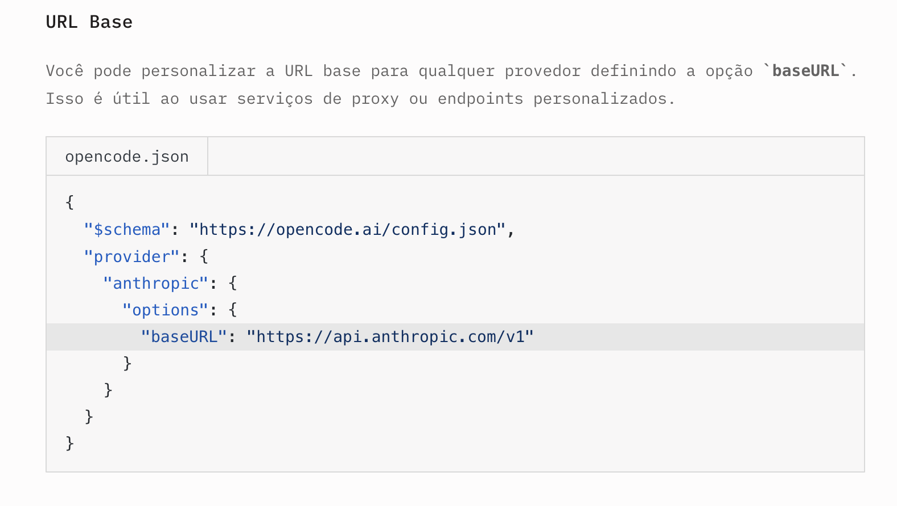
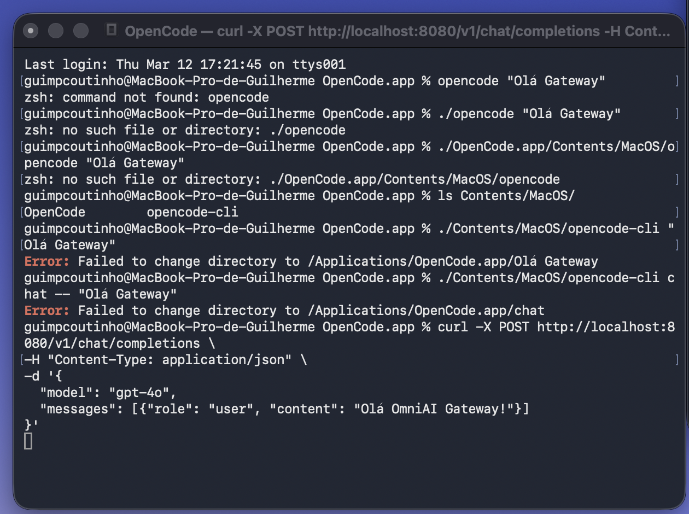
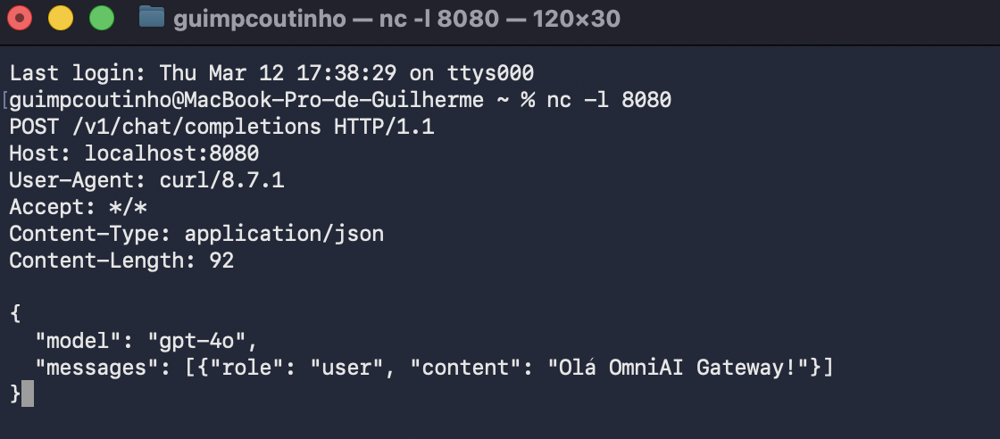

### Potential Client Applications for End-to-End (E2E) Scenarios in the OmniAI Gateway

Imaginando que a gateway implementa uma API compatível com OpenAI, diversas aplicações podem ser facilmente integradas, bastando alterar o endpoint da API para apontar para a api que a nossa gateway expoe em vez de um fornecedor específico.

Nas aplicações que seguem o conceito de **Open Code**, a integração com a OmniAI Gateway é feita através da sobreposição do `baseURL` padrão.  
Aplicações que deixam alterar endpoints de API:

    - Open Code
    - LibreChat
    - Dify

### Configuração via Open Code
De acordo com a [documentação oficial da Open Code](https://opencode.ai/docs/providers/), a integração é realizada através do ficheiro de configuração `opencode.json`.

Para apontar para a OmniAI Gateway, a configuração deve ser feita da forma na ikmagem abaixo:

Realizacao de um teste:

1.  **Configuração do Cliente:** Preparação do ficheiro de configuração (`opencode.json`) para definir o endpoint da API como `http://localhost:8080/v1`.
    

2.  **Simulação da Gateway:** Utilização da ferramenta **Netcat (`nc`)** no macOS para abrir a porta `8080` e escutar pedidos HTTP de entrada em tempo real.
    

3.  **Execução e Validação:** Mandar um pe pedido estruturado via `curl`, replicando o comportamento de aplicações "Open Code", para intercetar o pedido JSON.
    

No incio deu erro pq o pedido n estava estruturado seguido os pedidos que saibam openIa, mas depois de estruturar o pedido corretamente, o Netcat conseguiu receber o pedido JSON enviado pela Open Code.

### Configuração via LibreChat
O LibreChat [documentação oficial do LibreChat](https://www.librechat.ai/docs/quick_start/custom_endpoints)

### Configuração via Dify

